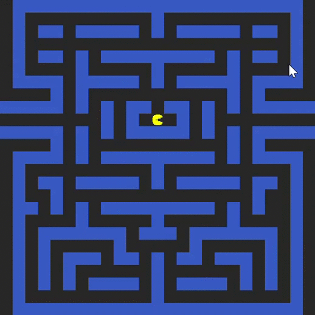

# PacMan
Implementation of path search algorithms for AI PacMan.

# Prerequisites
Project uses SFML library for graphics. For Windows, you can download it <a href="https://www.sfml-dev.org/download.php" target="_blank">`here`</a>

The project can be built from IDE (ex. CLion) or using cmake file

# How it works?
The project contains implementation of 4 algorithms: DFS, BFS, GREEDY, A*. By default A* is chosen. 

To choose a target for PacMan click anywhere on the map. With every next click you will set a new target.

In console you will see statistics for every algorithm.

You can change algorithm for path search in Path_algorithms.cpp file: 
```
std::vector<sf::Vector2f> Path_algorithms::getPath(const sf::Vector2f &from, const sf::Vector2f &to) {
    sf::Vector2f start = convertCoordinatesToMaze(from);
    sf::Vector2f end = convertCoordinatesToMaze(to);
    end.x = static_cast<int>(end.x);
    end.y = static_cast<int>(end.y);

    std::vector<sf::Vector2f> res_dfs = convertPathToCells(dfs(start, end));
    std::vector<sf::Vector2f> res_bfs = convertPathToCells(bfs(start, end));
    std::vector<sf::Vector2f> res_greedy = convertPathToCells(greedy(start, end));
    std::vector<sf::Vector2f> res_a_star = convertPathToCells(a_star(start, end));
    return res_a_star;
}
```

# Demo

